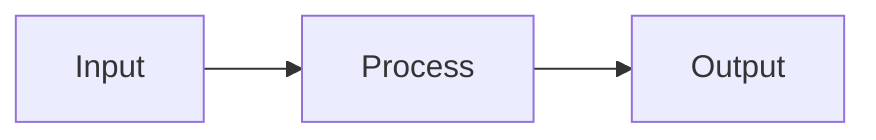

Hai kalian, terutama teman-teman game developer di kampus! Sudah memikirkan apa yang akan kalian lakukan setelah lulus? Sudah punya rencana? Apakah kalian tertarik menjadi programmer? Apa saja yang sudah kalian lakukan untuk mengembangkan kemampuan sebagai programmer, seperti membuat project atau rajin ngoding?

Namun, pertanyaannya, apakah itu sudah cukup? Dengan kemampuan kalian sekarang, siapa yang mau merekrut kalian? Ada ratusan atau ribuan orang dengan kemampuan serupa, jadi apa yang membuat kalian tak tergantikan? Di mana letak keunikan kalian?

Apa yang menghalangi usaha kalian? Apakah mood, prokrastinasi, manajemen waktu, orang lain, lingkungan, atau kesempatan? Pembahasan kali ini bukan untuk menggurui atau memberi nasihat, melainkan untuk menjadi momen ajakan agar kalian melatih diri, membangun kebiasaan positif bagi diri sendiri dan orang lain.

Ini bukan hanya omongan, tapi juga panduan praktis yang bisa diimplementasikan. Ingat, **membiasakan itu bukan dengan dinasehati, tapi dengan dilatih**.

**Mengapa Tidak Mengenai Hal Teknis?**

Mengapa kita tidak membahas hal-hal teknis seperti tutorial Unity atau Blender? Karena tutorial bisa dipelajari kapan saja dan di mana saja. Kita bisa mencari tahu sendiri. Kami sudah menyediakan sumber-sumber yang dapat membantu kalian dalam hal ini.
- https://roadmap.sh/
- https://github.com/wewnumam/gtstmm-gamedev-roadmap

Pertanyaannya, ada jutaan artikel dan video di internet, tapi mengapa kalian belum tahu? Mungkin karena belum mencari tahu atau memang tidak mau mencari tahu. Cara tahu? Cari tahu. Bagaimana caranya? **Miliki kebiasaan untuk mencari tahu**.

# Daftar Isi
- Cara Dunia Bekerja (Kompleks)
> 	Kenapa penting? Untuk memahami cara mengukur potensi. 
- Cara Manusia Bekerja (Kebiasaan)
> 	Kenapa penting? Untuk memaksimalkan potensi diri.
- Cara Programmer Bekerja (Pragmatis)
- Cara Unity Bekerja (Components)
# Fair Play & Unfair Advantage

~~SUCCESS~~ WINNER = FAIR PLAY x UNFAIR ADVANTAGE
## Fair Play
Wajib dimiliki untuk bertahan dan semua orang bisa tiru.
- Kemauan
- Kerja Keras
- Konsistensi
- Growth Mindset
## Unfair Adventage 
Faktor penentu posisi dan tidak semua orang bisa tiru.
- Money
- Intelligence & Insight
- Location & Luck
- Education & Expertise
- Status

> Aku bingung mengapa kita menuntut dari dosen untuk memberikan perlakuan fair play, seperti memberikan materi yang relevan dan menunjukkan sikap disiplin, sementara di sisi lain, dosen dapat memberikan unfair advantage seperti koneksi industri, fasilitas, dan keterlibatan dalam suatu proyek.

Juara tidak melakukan hal-hal yang luar biasa, mereka melakukan hal-hal biasa, hanya
saja tanpa berpikir, sedemikian cepat sehingga tim lawan tidak sempat bereaksi. Mereka
mengikuti kebiasaan-kebiasaan yang telah mereka pelajari.
# Pentingnya Kebiasaan
Sebagian besar pilihan yang kita buat setiap hari mungkin terasa sebagai hasil pembuatan
keputusan yang dipertimbangkan dengan baik, padahal sebenarnya bukan. Pilihan-pilihan
itu merupakan kebiasaan.

> Aplikasi apa yang pertama kali kalian buka entah di HP atau laptop? Instagram? Whatsapp? Facebook?
> Apakah kalian sadar kalian sedang memilih untuk membukanya?
> Ketika mendengar ringtone notifikasi, apa yang terlintas di pikiran kalian?

Kebiasaan, kata para ilmuwan, muncul karena otak terus-menerus mencari cara untuk menghemat upaya.

# Cara Memulai 
## Awareness
Kebiasaan adalah lingkar bertahap tiga—tanda, rutinitas, dan ganjaran.
Aturan Emas Perubahan Kebiasaan: Kita tidak bisa melenyapkan kebiasaan buruk,
melainkan hanya bisa mengubahnya. Bagaimana Cara Kerjanya: Gunakan tanda yang
sama, sediakan ganjaran yang sama, ubah rutinitasnya. 
## Goals
Gak punya goals gpp, kejar supaya kebutuhan dasar terpenuhi dulu:
- Sebagai manusia kita perlu bekerja untuk memenuhi kebutuhan hidup
- Sebagai pengangguran kita perlu hard skill untuk menjalankan tugas
- Sebagai game developer kita perlu bikin game
- Sebagai mahasiswa kita perlu .... untuk tujuan pribadi setelah lulus
- Belajar
	- dengan meluangkan waktu
	- dengan memanfaatkan fasilitas ada
- Membuka kesempatan
	- dengan menunjukkan diri
	- dengan melibatkan diri 
## Empat Kaidah Perubahan Perilaku
- menjadikannya terlihat (petunjuk),
- menjadikannya menarik (gairah), 
- menjadikannya mudah (tanggapan), dan
- menjadikannya memuaskan (ganjaran)

# Kebiasaan Progammer
- Pragmatis terhadap fitur
- Belajar berkelanjutan (stay up to date)
- Building second brain
## Problem Solving

## Day to Day Programmer
- Desain - Dokumentasi - Testing
	- Kalau berpikir tugas programmer itu ngoding, kurang tepat. Ngoding itu kerjaan tukang, bikin aplikasi itu kerjaan mandor, programmer itu kaya arsitek, mengembangkan aplikasi.
# Unity Components
...
# Harapan
- Bisa mengontrol diri sendiri
>	Jangan biarkan emosi membuat keputusan.
- Bisa mengukur dampak/akhir keputusan sehari-hari kita (kebiasaan)
>	Setiap tindakan memiliki konsekuensi.
- Bisa memprioritaskan tindakan kita
> 	Catat.
- Bisa mengerti apa pun tindakan dalam hidup itu take-and-give (win-win)
>	Tidak ada yang gratis. Sebuah hubungan bergantung pada pertukaran nilai.
- Bisa mengerti kebutuhan dan perspektif orang lain
> 	Dunia berjalan bukan berdasarkan kemauan kita.
- Bisa bersinergi dengan orang lain